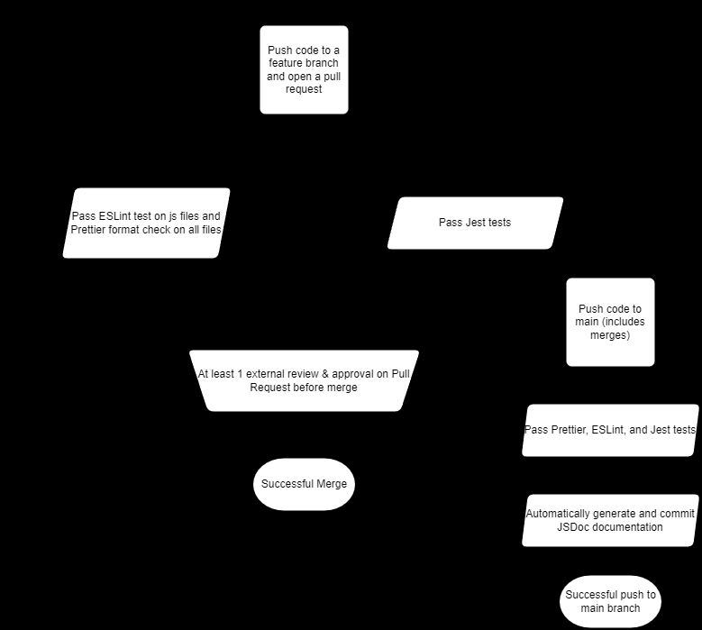

# Phase 2 CI Pipeline



## Branch Protection Plan

In our process of development in feature branches, each time code is pushed it runs through a series of tests and status checks:

- ESLint Check
- Prettier Formatting Check
- Jest Tests Check

Then when a pull request is opened, the code must pass all these checks and also gain the approval of one other developer in order to be merged into main.

### ESLint Check

In the process of development developers can use the following command to run the ESLint check which ensures consistent code and prevents bugs:

```bash
npm run lint
```

The pipeline then runs the same line in its own environment automatically whenever code is pushed.

### Prettier Format Check

Prettier is a code formatter that ensures all the code has a consistent style for appearance including spacing and indentation. Developers can format code using the following code:

```bash
npm run format
```

The pipeline then checks to make sure all the files were properly formatted.

### Jest Tests Check

Developers create jest tests to ensure their js functions are working as intended and currently there is a test function that checks for a "valid" card image and as the code for the web application is developed we intend on using functions from our actual code that can ensure our code works as intended. Developers can check their code using the following command:

```bash
npm run test
```

### JSDoc Generation

When developers push code to main, after the initial tests and checks JSDoc documentation is automatically generated. This comes from specially marked comments within .js files and is linked to in the README.

```bash
npm run jsdoc
```

## Future Plans

With the successful implementation of the above tests we plan to keep the unit tests and implement e2e tests when our pages are in their final stages.
