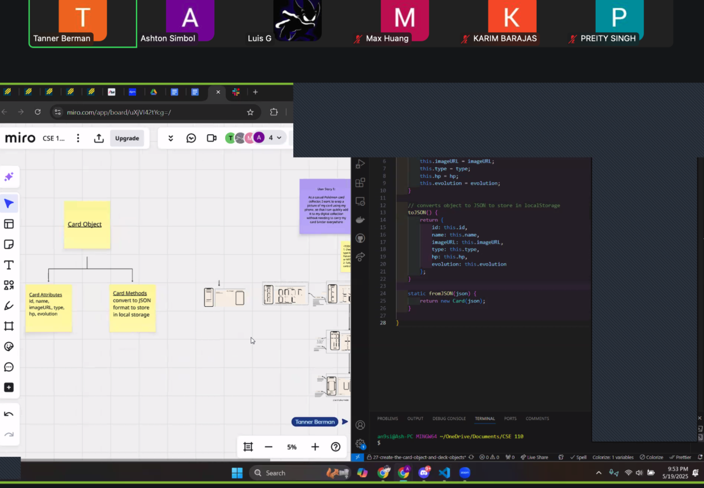

# 5/19 Sprint 1 & Sprint Retrospective Notes

Meeting Time: 5/19 9:00 PM

Meeting Location: Zoom

**Attendance:**
Tanner, Ashton, Eric, Graydon, Guthry, Jonathan, Karim, Luis, Max, Preity, Vishruth

---

## Sprint 1 Tasks

### Data Management of Cards & Local Storage (pt.1) – Backend

* Card Object
* Deck Object

**Members:** Ashton, Karim

### Card Component Page (Single Card Page) – Frontend

* Display a card and its fields

**Members:** Luis, Eric, Jonathan

### Image Upload Page – Frontend & Backend

* UI to upload image
* Save image into `localStorage`

**Members:** Preity, Tanner, Graydon

### Create Deck Feature (Page) – Frontend & Backend

* Visualize card deck
* Save deck into `localStorage`

**Members:** Vishruth, Guthry, Max

---

## Backlog

* Data management of cards (pt.2)
* Camera upload (use other libraries?)
* View multiple decks
* View specific deck
* View single card
* Figure out mass uploading pictures on deck creation page

---

## Status Updates

### Data Management of Cards & Local Storage (pt.1)

* Created basic class to utilize the labels
* Updated Miro with documentation

### Card Component Page

* Created rough draft of frontend UI
* Includes text, fields, and image placeholders
* Displays Deck Name, Card Name, Card Placeholder Image, and card attributes
* Implemented:

  * Arrow button to return to Deck Page
  * Button to manage fields

### Create Deck Feature

* Max worked on deck config, image upload, and card selection

### Image Upload Page / Card Creation Page

* Created basic card creation page with the ability to upload an image and enter the fields of the card

---

## Screen Captures

**Create Deck Feature:** 

**Card Component:** 

**Data** 

---