# 5/19 Sprint 2

Meeting Time: 5/25 2:00 PM

Meeting Location: Zoom

**Attendance:**
Tanner, Ashton, Guthry, Karim, Luis, Max

---

### _Ashton & Karim_

- **Ashton:**

  - Updated Pipeline with JSDoc
  - Updated ADRs
  - Refactored Repo
  - Settled on styling design (need to implement)

### _Luis, Eric, Jonathan_

- **Luis:**
  Implemented rough arrow functionality to switch between each single card. Added placeholder data fields to simulate how a card would be displayed with its fields.

### _Preity, Tanner, Graydon_

- **Tanner:**
  Fully transitioned the app’s data from localStorage to IndexedDB, created reusable API, updated Card and Deck models, and integrated IndexedDB into the Create Card page. Created two full manual tests to check that everything worked properly and for reference for other members to interact with the database themselves.

- **Preity:**
  Created `card-grid.html`, `card-grid.js`, and `style.css` under `src/pages/card-grid`.
  Implemented responsive card grid using dummy data (3 Pokémon cards)
  Each card tile includes:

  - Image and name
  - Edit and Delete buttons (functionality not implemented yet)
    Page is styled with CSS Grid and includes hover effects for interactivity
    IndexedDB integration is commented out for now due to timing… will enable once card data is available

### _Vish, Guthry, Max_

- **Max:**
  Replaced back image with thumbnail and added to deck data; connected create deck to IndexedDB; encapsulated bulk upload feature into a new modal

- **Guthry:**
  Worked on deck view, ran into couple of blockers listed below

---

## Sprint 2 Blockers

- Several members had very busy schedules involving midterms, weekend commitments, etc. and were not able to complete as much work during the sprint as they had planned.

- **Guthry:**
  My current blockage with the deck view I'm working on:
  For the record, this branches off of the version of the source code that uses localStorage not indexDB, once I figure out what is causing this I can switch over. Same with UI.
  I also ripped much of the code from Lab 6, (the spooky cookies, as it seemed like a similar task).
  You'll find the code short and sweet, without most features yet. I did this

  1. so I could debug easier
  2. I planned on adding all of the features once I was able to do the basics (like add a web component without loading in data from storage, or adding the shadowDom information yet for the component.) That way I could tackle each issue one by one.

  So the main issue I am stuck on is the:
  `(Uncaught DOMException: Operation is not supported)` error as shown in the attachments.

  From debugging, these were the causes I could come up with from which I tried to do process of elimination:

  - that line 55 isn't correct syntax (which I don't think it is?? it seems pretty simple)
  - there's some environment restriction on creating elements in the document in the context of the function or in the html file (I'm not sure why either would be case.)
  - my file paths aren't correct (I triple checked this to be correct, and also it gives you an error when it cannot find the file path, which it didn't in this case.)
  - my code for deck-display web component is incorrect, or it wasn't loaded in yet. What is confusing is that from print statements, it is clear that it is being loaded, so that isn't the issue. I also ensured this with typing out:
    `customElements.whenDefined('deck-display').then(() => {})` inside init, and then running the script for the deck viewing page only inside this block.

    - It’s odd that the custom element loaded fine, and only gives an error when I try to instantiate it.

  - my code alterations to the Deck class aren't correct for implementing a web component. (I think this is most likely the case). I saw that you shouldn't take in parameters for a web component constructor, and instead use a set data function, so I changed that. I think the issue lies somewhere in here, but I'm not sure where and the JavaScript debugging information isn't helpful (I made a breakpoint at that line, stepped in the function call and subsequently the constructor, and it only gave an error once it exited once it stepped out and went on to line 56)

    - btw I commented many of the other functions just to narrow down in the debugging process, that is not me removing anything (although I do end up planning to use the new Deck class in the indexDB update recently.)
      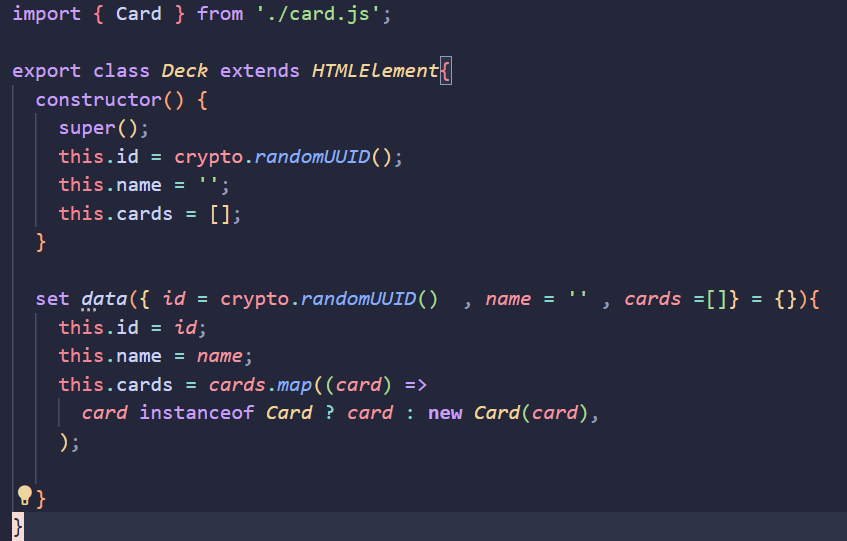
      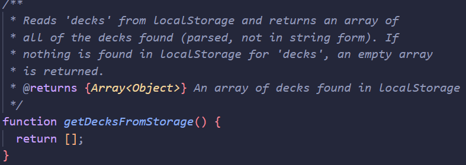
      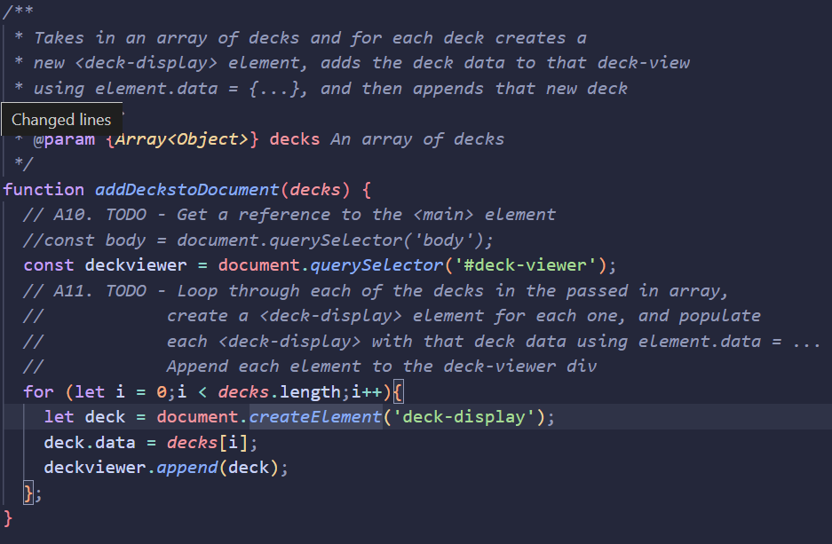
      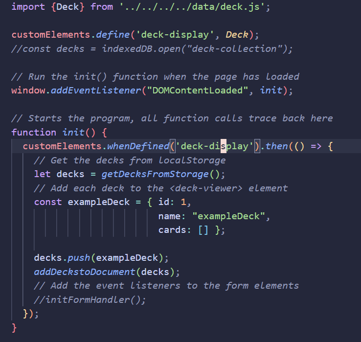
      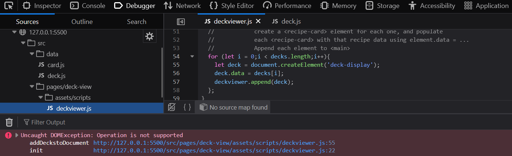

---

**Screenshots from Review meeting**
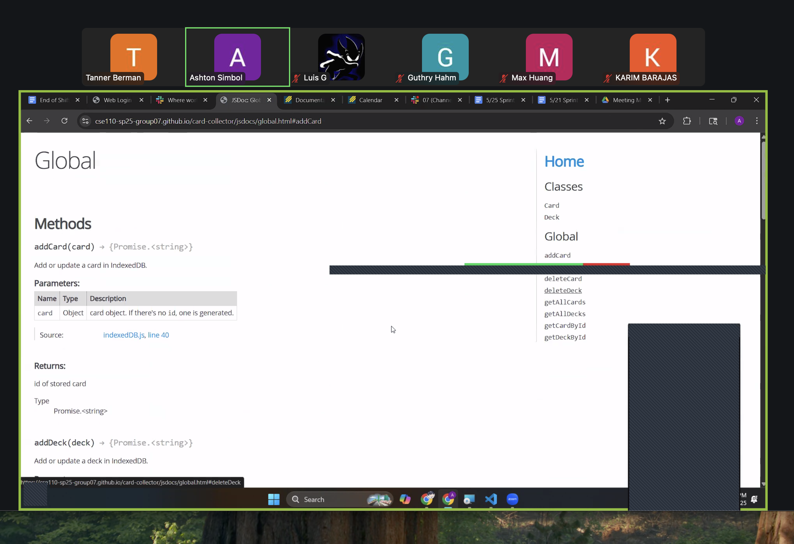
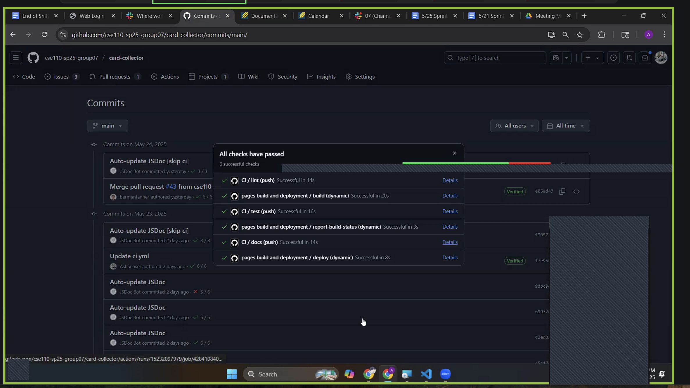
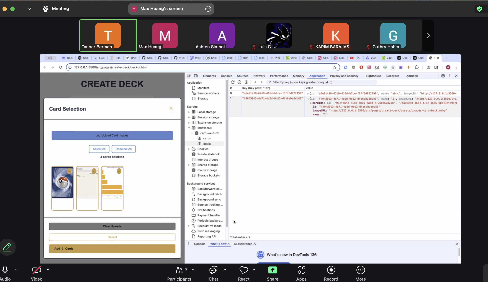
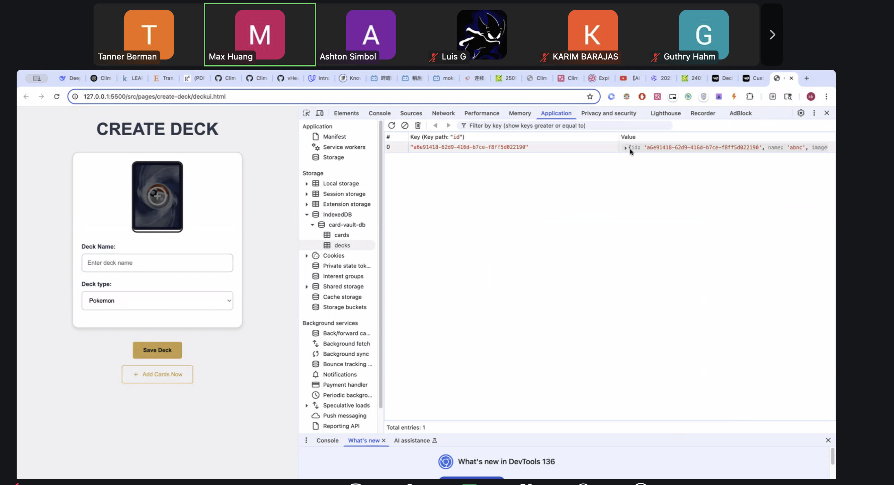
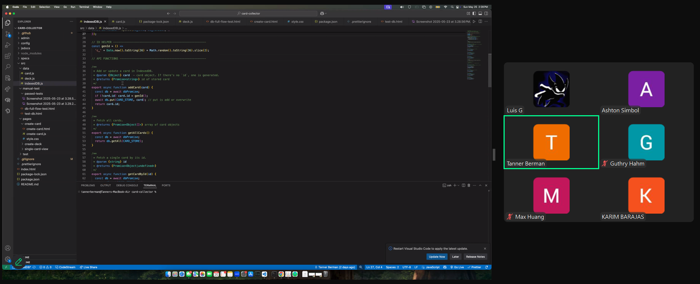
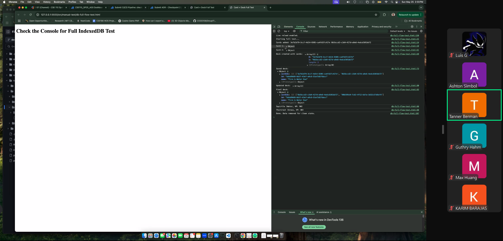
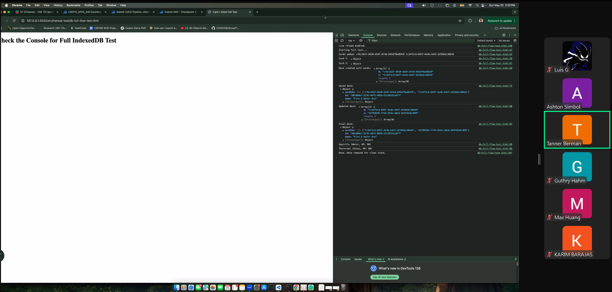
