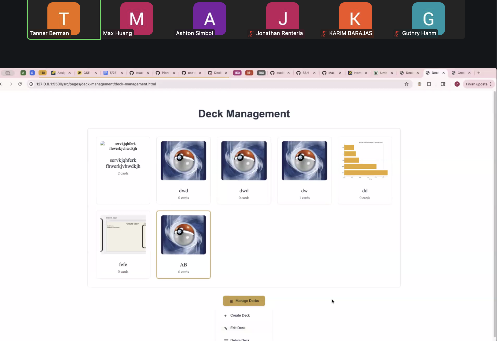
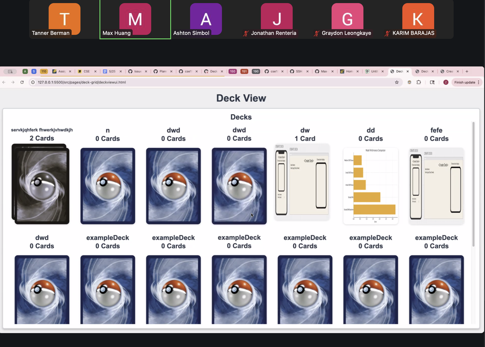
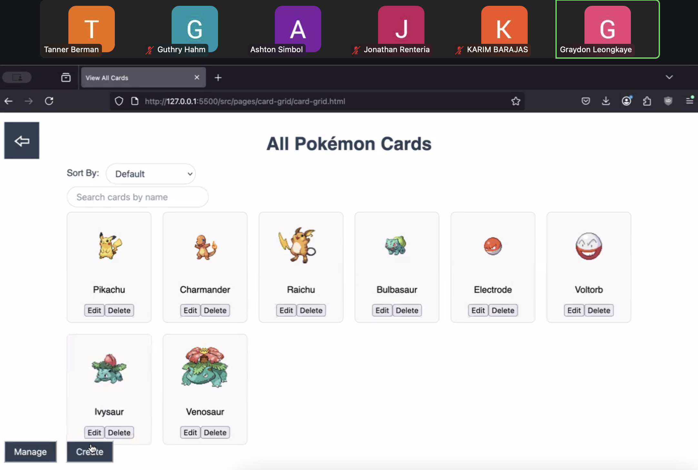
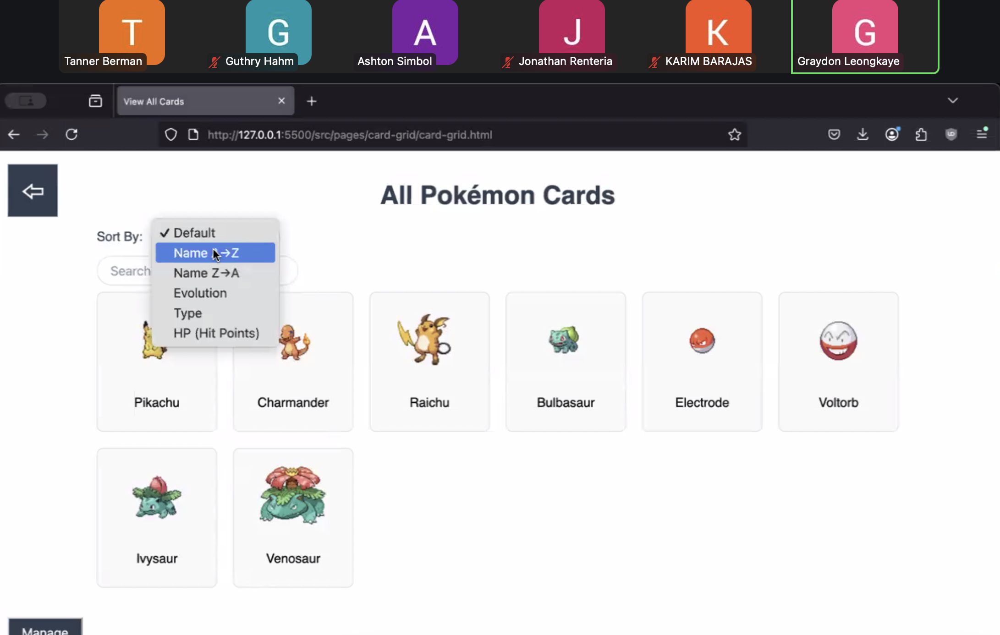
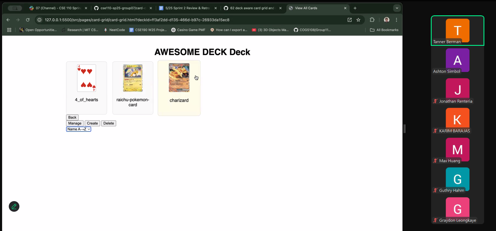
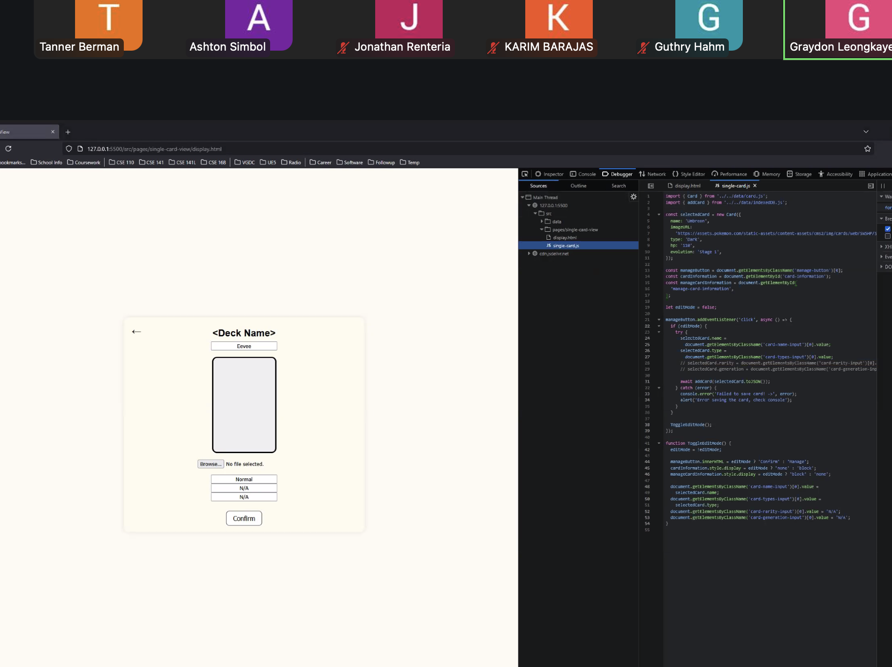
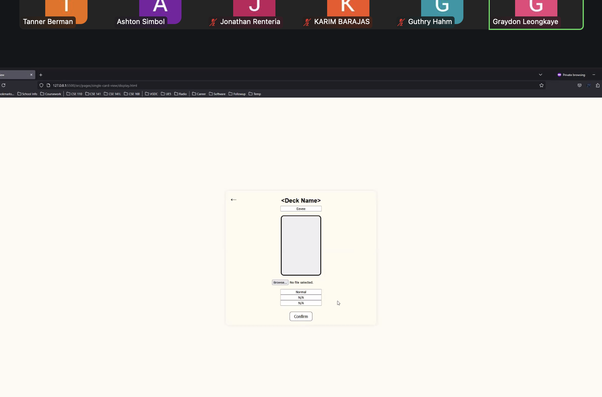
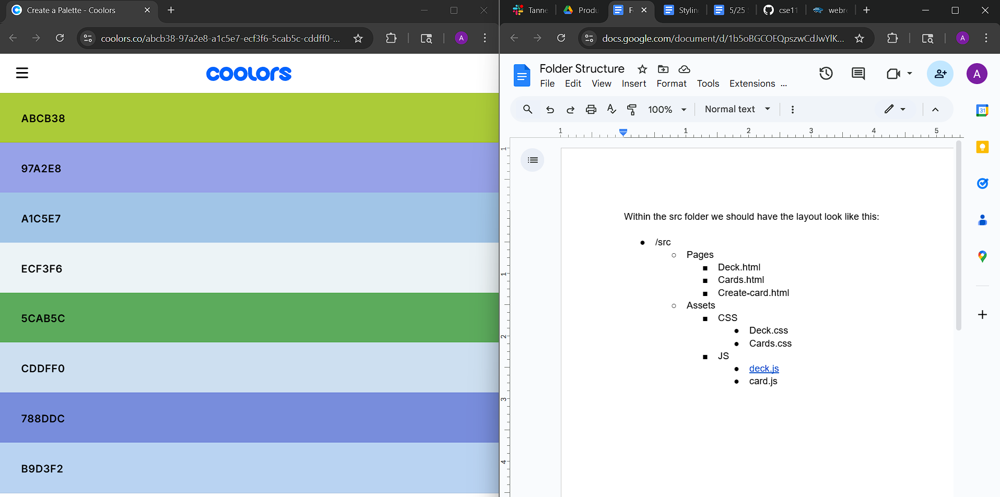
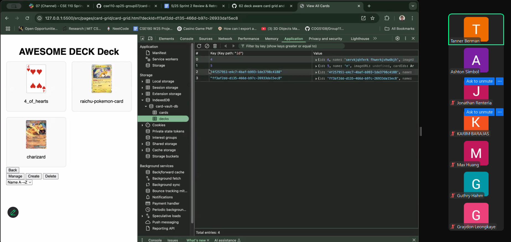

# 5/19 Sprint 2

Meeting Time: 6/01

Meeting Location: Zoom

**Attendance:**
Ashton, Tanner, Jonathan, Guthry, Max, Karim, Graydon, and Luis

---

### _Ashton & Karim_

- Karim: Worked with Ashton on discussing and agreeing potential designs and style for the card collecting site. What I did was I wrote the style that was needed for our index.html file that’s located at the root. Not only that, but I pushed what I did to our branch.
- Ashton: Worked with Karim on implementing styling, settled on and documented color palette for the website, also devised a new folder structure for the website so it can be cleaner and a true [MPA](https://medium.com/@julianneagu/multi-page-application-mpa-a-good-business-fit-36029c7be9f0)

### _Luis, Eric, Jonathan_

- Jonathan: Pushed basic single card edit view, plan to finish Wednesday
- Luis:
  - Cleaned, Upgraded, and Stylized the Single Card UI, with smoother card transitions and cleaner text graphics
  - Implemented card navigation functionality, along with adding sample data set to display a deck’s name, a card’s name, and its fields such as rarity, gen, and type.

### _Preity, Tanner, Graydon_

- Tanner: The card grid now loads and displays only the cards associated with the selected deck. Additionally, I implemented delete functionality for individual cards.
- Graydon: Implemented the functionality for searching and sorting in a deck-view
- Preity: Implemented the create-card workflow to make it deck-aware. The form pulls the deckId from the URL and, when submitted, creates a new card, saves it to the global card store, and updates the deck with the new card ID. I also added a "Back to Deck View" button.

### _Vish, Guthry, Max_

- Vish:
  - Created deck-management.html, script.js, style.css in /src/pages/deck-management , updated script.js in /src/pages/create-deck , and updated indexDB.js in /src/data
  - Implemented deck management control buttons within a dropdown menu:
  - Added a “Create Deck” button that links to the respective Create Deck page.
  - Added an “Edit Deck” button that routes to the Edit Deck page, preloading the selected deck’s data into the form. Also allows the user to change the name, thumbnail, and category of the deck.
  - Added a “Delete Deck” button that removes the data from the database along with a confirmation prompt.
  - Implemented the updateDeck function in indexedDB to round off the editing deck functionality.
  - Added a minimal UI design for the buttons and general page layout via the CSS styling and HTML setup.
- Guthry:
  - Created everything in deck-grid folder, created **deckdisplay.js** in src/data/
  - **deckdisplay.js** contains the class for the deck-display web component, which takes in a Deck object as a parameter to create a display for it. This way the original Deck class can remain unchanged.
    - Made deck display webcomponent display the first 3 card’s images inside the deck stacked on top of each other, otherwise it displays the default image for decks
    - Made the deck-display show info such as name and card count
      - Made the name font-size automatically shrink to match the length of the name so it fits inside of the web component
  - Created grid to display the deck displays, pulls all decks from indexedDB storage using getAllDecks() from src/data/[indexedDB.js](http://indexedDB.js)
- Max
  - Implemented the deck view page with Guthry. Vish implemented the menu button for creating, editing, and deleting decks.

**Screenshots from Review meeting**

